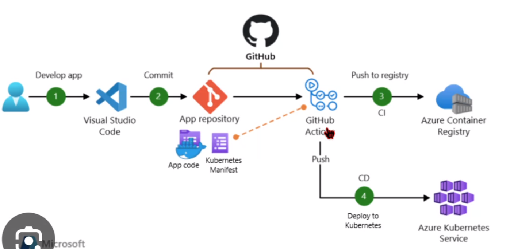

[교제 링크](https://visioneer.notion.site/Project1_Youtube-988b009559144545aa7e2ab4eb354d6c)  

# instruction  
1. 폴더생성  
2. 깃허브 레포지토리 생성  
3. 

### CI CD  
  

프로젝트

1. Youtube REST API
● db 설계 (모델 구조)
• 유튜브 데이터 크롤링 → DB 넣가

· DB: Postgre SQL

• 기능:

○ 유튜브 REST API ⇒ DRF
○ 소켓 연결을 통한 실시간 채팅 기능 구현 (방 기능까지)
o 영상 스트리밍

○ 영상을 시청 ⇒ 시청 데이터 ⇒ 추천 알고리즘 (모델링) - FastAPI

2. Youtube Dashboard
● ELK(Elasticsearch, Logstash, Kibana) Stack을 활용한 로그 데이터 시각화

3. Youtube Creator Support
· OpenAI API -> FastAPI
• 유튜브 컨텐츠를 만들 수 있도록 도와주는
• OpenAIl API를 활용해서 썸네일 및 스크립트 제작
